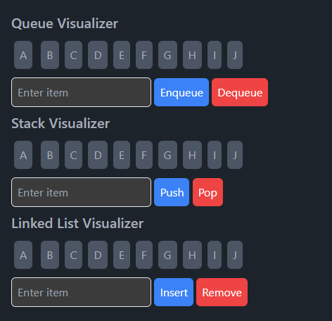

# Algorithm Visualizer
This repository contains a dynamic and interactive visualizer for a wide array of algorithms and data structures. It's designed to provide a clear and educational insight into how different algorithms and data structures work under the hood. 

[Try it out!](https://berkanktk.github.io/Algorithm-visualizer/)

<!--  -->

# List of Contents
- [Sorting Algorithms](#sorting-algorithms)
  - [Bubble Sort](#bubble-sort)
  - [Selection Sort](#selection-sort)
  - [Insertion Sort](#insertion-sort)
  - [Merge Sort](#merge-sort)
  - [Quick Sort](#quick-sort)
- [Searching Algorithms](#searching-algorithms)
  - [Linear Search](#linear-search-sequential-search)
  - [Binary Search](#binary-search)
  - [Jump Search](#jump-search)
  - [Exponential Search](#exponential-search)
- [Maze Generation Algorithms](#maze-generation-algorithms)
  - [Binary Tree Algorithm](#binary-tree-algorithm)
  - [Randomized Backtracking (DFS)](#randomized-backtracking-dfs)
  - [Randomized Prim](#randomized-prim)
  - [Randomized Kruskal](#randomized-kruskal)
  - [Hunt and Kill](#hunt-and-kill)
- [Pathfinding Algorithms](#pathfinding-algorithms)
  - [Dijkstra's Algorithm](#dijkstras-algorithm)
  - [A* Search](#a-search)
  - [Breadth-First Search](#breadth-first-search)
  - [Depth-First Search](#depth-first-search)
- [Data Structures](#data-structures)
  - [Stack](#stack)
  - [Queue](#queue)
  - [Linked List](#linked-list)
- [Recommendation System](#recommendation-system)
  - [Collaborative Filtering](#collaborative-filtering)
  - [Content-Based Filtering](#content-based-filtering)

## Sorting Algorithms
<div style="display:flex; justify-content:center;" align="center">
  
  
</div>

> Mergesort and Quicksort have some minor issues with the visualization. I will fix them soon.
### Bubble Sort
* This is the simplest sorting algorithm.
* It repeatedly compares adjacent elements and swaps them if they are in the wrong order.
* Time complexity is O(n<sup>2</sup>) in the worst case.
* Space complexity is O(1) in the worst case..

### Selection Sort
* This algorithm sorts an array by repeatedly finding the minimum element from the unsorted part and putting it at the beginning.
* Time complexity is O(n<sup>2</sup>) in the worst case.
* Space complexity is O(1) in the worst case.

### Insertion Sort
* This algorithm sorts an array by repeatedly inserting an element from the unsorted part into its correct position in the sorted part.
* Time complexity is O(n<sup>2</sup>) in the worst case.
* Space complexity is O(1) in the worst case.

### Merge Sort
* This algorithm divides the array into two halves, sorts them separately, and then merges the two sorted halves.
* Time complexity is O(n log n) in the worst case.
* Space complexity is O(n) in the worst case.

### Quick Sort
* This algorithm picks an element as a pivot and partitions the array around the pivot.
* Time complexity is O(n<sup>2</sup>) in the worst case.
* Space complexity is O(log n) in the worst case.

## Searching Algorithms
<div style="display:flex; justify-content:center;" align="center">
  
  
</div>

###  Linear Search (Sequential Search)
* This is the simplest search algorithm.
* It sequentially checks each element in a list until a match is found.
* Works well for small lists or unsorted data.
* Time complexity is O(n) in the worst case.

### Binary Search
* This is a more efficient search algorithm, but it requires sorted data.
* It repeatedly divides the search interval in half to find the desired item.
* Time complexity is O(log n) in the worst case.

### Jump Search
* Jump Search divides the list into smaller blocks and checks these blocks to reduce the number of comparisons.
* Requires sorted data.
* Time complexity is O(√n) in the worst case.

### Exponential Search
* Exponential Search finds the range in which the desired item is located by jumping 2<sup>i</sup> elements in every iteration and then performs a binary search in that range.
* Requires sorted data.
* Time complexity is O(log n) in the worst case.

## Maze Generation Algorithms

### Binary Tree Algorithm
* Complexity: Simplest
* This algorithm creates a maze by repeatedly carving passages either to the north or to the east.
* It is a simple algorithm, but it produces mazes with a strong north-east bias.
* It doesn't require maintaining a complex state or backtracking.

### Randomized Backtracking (DFS)
* Complexity: Moderate
* Involves a stack and backtracking to create a maze
* It generates mazes with a single solution and a moderate level of complexity, but the paths tend to have a long and winding nature.
  
### Randomized Prim
* Complexity: More Complex
* This algorithm creates a maze by randomly selecting a wall from the list of walls that separate cells in the maze and removing it if the cells on both sides of the wall belong to different sets.
* It's more efficient in space utilization than the DFS method.
  
### Randomized Kruskal
* Complexity: Most Complex
* This algorithm creates a maze by randomly selecting a wall from the list of walls that separate cells in the maze and removing it if the cells on both sides of the wall belong to different sets.
* Produces mazes with a high degree of complexity and less bias compared to the other algorithms.

### Hunt and Kill
* Complexity: A little more complex than DFS
* This algorithm creates a maze by randomly selecting a cell and carving a passage in a random direction from that cell.
* It then performs a random walk, carving passages to unvisited cells until it reaches a dead end.

## Pathfinding Algorithms

### Dijkstra's Algorithm
* This algorithm finds the shortest path between two nodes in a graph.
* It uses a priority queue to keep track of the next node to visit.

### A* Search
* This algorithm is an extension of Dijkstra's algorithm.
* It uses a heuristic function to estimate the distance between the current node and the destination node.
* It uses a priority queue to keep track of the next node to visit.
* It is faster than Dijkstra's algorithm.

### Breadth-First Search
* This algorithm finds the shortest path between two nodes in a graph.
* It uses a queue to keep track of the next node to visit.

### Depth-First Search
* This algorithm finds the shortest path between two nodes in a graph.
* It uses a stack to keep track of the next node to visit.

## Data Structures
<div style="display:flex; justify-content:center;" align="center">
  
</div>

### Stack
* A stack is a linear data structure that follows the Last In First Out (LIFO) principle.
* It has two main operations: push and pop.
* It can be implemented using an array or a linked list.
* Time complexity of push and pop operations is O(1).
* Space complexity is O(n).

### Queue
* A queue is a linear data structure that follows the First In First Out (FIFO) principle.
* It has two main operations: enqueue and dequeue.
* It can be implemented using an array or a linked list.
* Time complexity of enqueue and dequeue operations is O(1).
* Space complexity is O(n).

### Linked List
* A linked list is a linear data structure that consists of nodes.
* Each node has a data field and a pointer to the next node.
* It can be implemented using a singly linked list or a doubly linked list.
* Time complexity of insertion and deletion operations is O(1).
* Space complexity is O(n).

## Recommendation System

### Collaborative Filtering
> Will not be implemented
* This algorithm finds similar users based on their ratings and recommends items that they have rated highly.
* It uses the Pearson correlation coefficient to measure the similarity between users.
* It uses the weighted average of ratings to predict the ratings of items.

### Content-Based Filtering
* This algorithm recommends items that are similar to the items that the user has liked in the past.
* It uses the cosine similarity to measure the similarity between items.
* It uses the weighted average of ratings to predict the ratings of items.

#### Planned work
1. Get images from unsplash
2. Use GCP Vision API to get labels
```json
{
  "1.jpg": [
    {
      "locations": [],
      "properties": [],
      "mid": "/m/0c9ph5",
      "locale": "",
      "description": "Flower",
      "score": 0.9955990314483643,
      "confidence": 0,
      "topicality": 0.9955990314483643,
      "boundingPoly": null
    },
    {
      "locations": [],
      "properties": [],
      "mid": "/m/04sjm",
      "locale": "",
      "description": "Flowering plant",
      "score": 0.9854584336280823,
      "confidence": 0,
      "topicality": 0.9854584336280823,
      "boundingPoly": null
    },
    [...]
  ]
}
```
3. Format data 
4. Calculate TF-IDF
5. Calculate cosine similarity between images
6. Use labels to find similar images
7. Use similar images to find similar items
8. Use similar items to recommend items